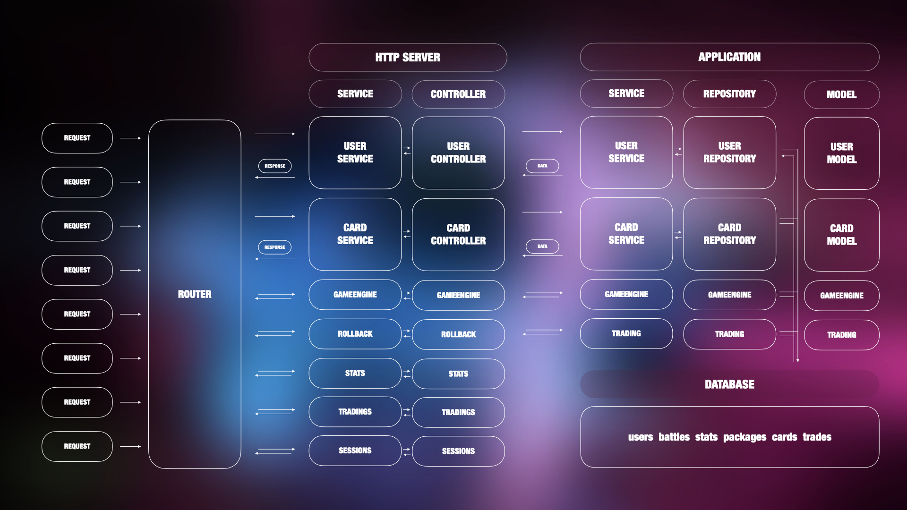
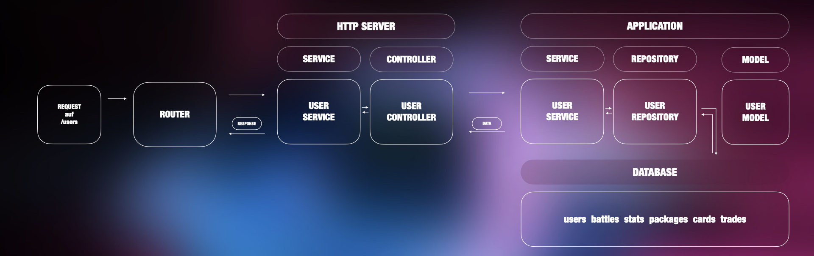

# MonstersAndSpellsV
## Protocol

## Server Architecture
Die folgende Grafik zeigt den generellen Aufbau von Monsters and Spells V.
Zentrales Element stellt der Router dar, welcher in der Main Funktion initialisiert wird. Die verschiedenen
Pfade werden auf die verschiedenen Services aufgeteilt. Darunter: /user, /sessions, /stats, /score, /packages, /transactions, /cards, /deck, /battles, /tradings, /rollback.

### Services
Die HttpServices beinhalten jeweils eine handleRequest-Methode und handeln je nach Request an den Controller weiter, welcher die eigentlichen Services beinhaltet.

**UserController:** create / update / get Users

**CardController:** acquire / create Packages; get all user cards, get deck of user, configure deck of user

**SessionController:** login user

**StatsController:** get stats of user / get scoreboard

**TradingController:** get / add / delete trades; trade

**GameEngineController:** register for battle (could execute battle, if users are waiting)

### /users request
Anhand der folgenden Grafik soll der Ablauf eines Requests auf /users beschrieben werden.
**Request** bestehend aus: POST, url/users, Content: JSON, data: username, password

1. Request wird von Router an UserService weitergeleitet.
2. UserService leitet Anfrage aufgrund der Method.POST an UserController.createUser(request) weiter
3. UserController.createUser erstellt ein User Model mit username und password und gibt dieses an den Application-UserService.create(user) weiter
4. Appl.UserService.create(user) ruft direkt das UserRepository.create(user) auf und returned dessen Rückgabe-Wert
5. UserRepository.create() checkt als erstes mit einer Privat-Function, ob der User schon existiert. Falls ja gibt die Funktion 0 zurück, falls nicht, wird der User sowohl in der users Tabelle, als auch zusammenhängend in der stats Tabelle erstellt und 1 zurückgegeben.
6. Angenommen der User existiert noch nicht, gibt der Appl.UserService.create() eine 1 zurück an den Http.UserController
7. Abhängig vom Rückgabe-Wert (in einem Switch Statement) gibt der Controller nun entweder einen Response CREATED + User-Daten als JSON-String, oder BAD_Request, mit Message an den Http.UserService zurück.
8. Http.UserService handleRequest Methode gibt diesen Response an Router zurück → der wiederum an Quelle zurück.

## Battle Logic
In der DB dient die Tabelle "battles" als Lobby. Wenn sich ein User für ein Battle registriert checkt der BattleLogicService ob bereits ein User in der Lobby wartet. 
Falls ja: Wird ein Battle mit eben diesem User gestartet. Falls nein, wird der user in die Lobby und damit in diese Tabelle eingetragen.

## Setup
### Database
### Server

## Usage

## Unit Tests

